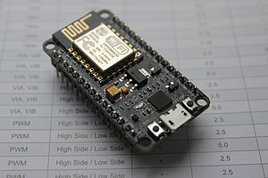
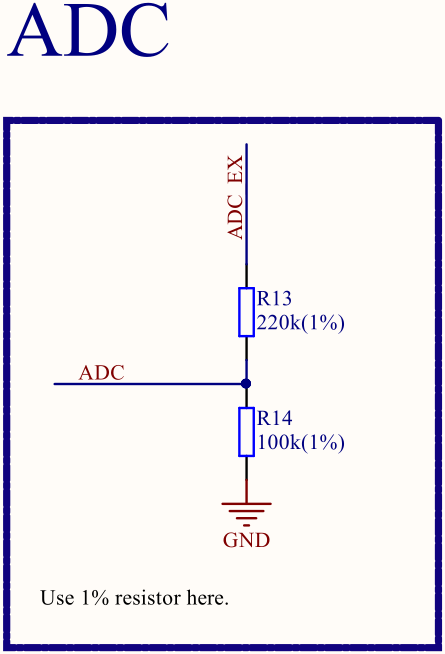

# NodeMCU

Just some hobby projects for me, myself and I.
The are based on this piece of really cheap hardware.

[](https://en.wikipedia.org/wiki/NodeMCU#/media/File:NodeMCU_DEVKIT_1.0.jpg)

The whole Arduino world gives you a great (but not easy) headstart when it comes to bringing wireless stuff up.
But if you want to dig deeper, it's a pain.
The IDE simply sucks pretty hard.
And the hardware shows quite soon its limitations.
For example the analog-digital-converter pin isn't usable out of the box.



At least the [schematics](https://raw.githubusercontent.com/nodemcu/nodemcu-devkit-v1.0/master/NODEMCU_DEVKIT_V1.0.PDF) are available so this should be fixable.
We only "should"?
Because the fix affects one *reserved* pin.
It may work out, but it also may not.

## Sketches

* [Drifter](sketches/Drifter) contains a webserver that converts analog levels of multiplexed sources.
  Therefore additional hardware is necessary.
  [Something](https://assets.nexperia.com/documents/data-sheet/74HC_HCT4067.pdf) has to do the multiplexing.
  Those levels are then brought into a readable format and afterwards provided through a self-refreshing webpage.
  The hardware works as an access-point with the ESSID `Drifter` and the password [`MaxPower`](https://www.youtube.com/watch?v=Ex9NaA2hetg).

## Gettings started

Get and install [Arduino](https://www.arduino.cc/en/Main/Software#download).
It installs only Arduino stuff.
The packages for [NodeMCU](https://www.esp8266.com/wiki/doku.php?id=nodemcu) must be installed seperately.

1) Open the Arduino IDE
2) File -> Preferences
3) Add `http://arduino.esp8266.com/stable/package_esp8266com_index.json` to 'Additional Boards Manager URLs' and click OK
4) Tools -> Board -> Boards Manager
5) Filter for `esp8266` and install the `esp8266` package which is provided by the *EPS8266 Community*

It's now possible to create binaries for the NodeMCU, but in order to flash it, another tool is necessary.
[`esptool.py`](https://github.com/espressif/esptool) is the python script that is used for erasing, flashing and so on.

6) `$ pip install pyserial`
7) `$ pip install esptool`
8) Plug in the board, to see what group membership is necessary in order to access the device.
   On my system ([**arch** linux](https://www.archlinux.org/)) it looks like this.
   ```
   $ ls /dev/ttyUSB* -Al
   crw-rw---- 1 root uucp 188, 0 Apr 25 17:15 /dev/ttyUSB0
   ```
   So I have to make sure, that my user is in the `uucp` group.
   Otherwise I'm not allowed to access `/dev/ttyUSB0`.

Information about the hardware is found on [github](https://github.com/nodemcu/nodemcu-devkit-v1.0).
